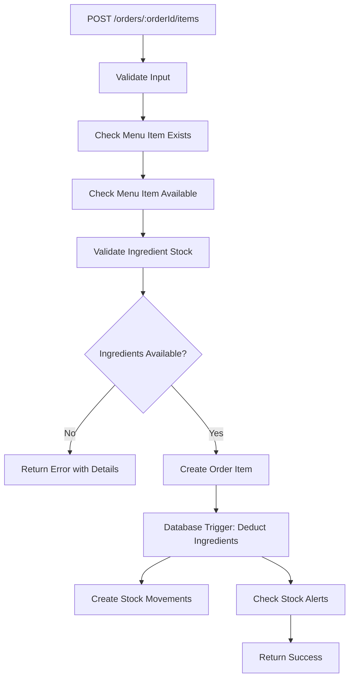
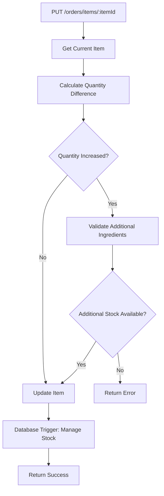

# 🍽️ Restaurant Ingredient Validation System

A comprehensive ingredient validation and stock management system for restaurant order processing. This system automatically validates ingredient availability, prevents overselling, and manages inventory in real-time.

## 📋 Table of Contents

- [Overview](#overview)
- [Features](#features)
- [Installation](#installation)
- [API Endpoints](#api-endpoints)
- [How It Works](#how-it-works)
- [Database Functions](#database-functions)
- [Testing](#testing)
- [Frontend Integration](#frontend-integration)
- [Troubleshooting](#troubleshooting)

## 🎯 Overview

The Ingredient Validation System ensures that your restaurant never runs out of ingredients during order processing. It automatically:

- ✅ Validates ingredient availability before creating orders
- ✅ Prevents overselling when stock is insufficient
- ✅ Automatically deducts ingredients when orders are created
- ✅ Restores ingredients when orders are cancelled
- ✅ Creates stock alerts when ingredients are low
- ✅ Provides real-time stock monitoring

## 🚀 Features

### **Automatic Ingredient Validation**
- Real-time stock checking before order creation
- Detailed error messages for insufficient ingredients
- Smart validation for quantity updates

### **Stock Management**
- Automatic ingredient deduction via database triggers
- Stock restoration on order cancellations
- Real-time stock level monitoring

### **Admin Monitoring**
- Stock status dashboard
- Active stock alerts
- Menu item availability overview

### **API Integration**
- RESTful endpoints for all operations
- Comprehensive error handling
- Detailed response data

## 🛠️ Installation

### **1. Deploy Database Functions**

Run the database setup script in your Supabase SQL editor:

```sql
-- Execute this in Supabase SQL Editor
\i ingredient-deduction-system.sql
```

This creates:
- Database functions for ingredient validation
- Automatic triggers for stock management
- Views for real-time monitoring
- Stock alert system

### **2. Update Your API**

The system integrates with your existing order routes. No additional setup needed - the validation is automatically applied to:

- `POST /orders/:orderId/items` - Order item creation
- `PUT /orders/items/:itemId` - Order item updates

### **3. Test the System**

Run the test script to verify everything works:

```sql
-- Execute this in Supabase SQL Editor
\i test-ingredient-deduction-system.sql
```

## 📡 API Endpoints

### **Order Management (Enhanced)**

#### **Create Order Item**
```http
POST /orders/:orderId/items
Content-Type: application/json

{
  "menu_item_id": "beef-rice-bowl-id",
  "quantity": 2,
  "customizations": {"spice_level": "medium"},
  "special_instructions": "Extra sauce"
}
```

**Response (Success):**
```json
{
  "success": true,
  "message": "Item added to order successfully",
  "data": {
    "id": "order-item-id",
    "menu_item_id": "beef-rice-bowl-id",
    "quantity": 2,
    "unit_price": 150.00,
    "total_price": 300.00
  }
}
```

**Response (Insufficient Ingredients):**
```json
{
  "success": false,
  "error": "Insufficient ingredients: Beef, Rice",
  "details": {
    "unavailable_ingredients": [
      {
        "ingredient_id": "beef-id",
        "ingredient_name": "Beef",
        "required_quantity": 0.4,
        "available_stock": 0.2,
        "shortage_amount": 0.2
      }
    ],
    "max_available_quantity": 1
  }
}
```

#### **Update Order Item**
```http
PUT /orders/items/:itemId
Content-Type: application/json

{
  "quantity": 3
}
```

**How it works:**
- Validates additional ingredients needed (not the full quantity)
- Automatically manages stock changes via database triggers

### **Ingredient Validation Endpoints**

#### **Check Menu Item Availability**
```http
GET /orders/menu-items/:menuItemId/availability?quantity=2
```

**Response:**
```json
{
  "success": true,
  "data": {
    "menu_item_id": "beef-rice-bowl-id",
    "menu_item_name": "Beef Rice Bowl",
    "requested_quantity": 2,
    "is_available": false,
    "unavailable_ingredients": [
      {
        "ingredient_id": "beef-id",
        "ingredient_name": "Beef",
        "required_quantity": 0.4,
        "available_stock": 0.2,
        "shortage_amount": 0.2
      }
    ],
    "max_available_quantity": 1
  }
}
```

#### **Stock Status Monitoring (Admin Only)**
```http
GET /orders/inventory/stock-status
```

**Response:**
```json
{
  "success": true,
  "data": [
    {
      "id": "beef-id",
      "name": "Beef",
      "current_stock": 0.6,
      "min_stock_threshold": 2.0,
      "unit": "kg",
      "stock_status": "low_stock",
      "stock_percentage": 30.0,
      "supplier": "Meat Supplier Co."
    }
  ]
}
```

#### **Active Stock Alerts (Admin Only)**
```http
GET /orders/inventory/alerts
```

**Response:**
```json
{
  "success": true,
  "data": [
    {
      "id": "alert-1",
      "alert_type": "out_of_stock",
      "message": "Rice is out of stock!",
      "current_stock": 0.0,
      "threshold_value": 1.0,
      "ingredient_name": "Rice",
      "unit": "kg"
    }
  ]
}
```

#### **Menu Items Availability Overview**
```http
GET /orders/menu/availability
```

**Response:**
```json
{
  "success": true,
  "data": [
    {
      "id": "beef-rice-bowl-id",
      "name": "Beef Rice Bowl",
      "price": 150.00,
      "menu_available": true,
      "ingredient_available": false,
      "missing_ingredients_count": 2,
      "menu_categories": {
        "id": "main-course-id",
        "name": "Main Course"
      }
    }
  ]
}
```

## ⚙️ How It Works

### **Order Item Creation Flow**



### **Order Item Update Flow**



### **Automatic Stock Management**

The system uses database triggers to automatically:

1. **Deduct ingredients** when order items are created
2. **Restore ingredients** when order items are deleted
3. **Adjust stock** when order item quantities change
4. **Create stock alerts** when ingredients fall below thresholds
5. **Record stock movements** for audit trails

## 🗄️ Database Functions

### **Core Functions**

#### **check_ingredient_availability(menu_item_id, quantity)**
Returns detailed ingredient availability information for a specific menu item and quantity.

#### **get_menu_item_availability(menu_item_id, quantity)**
Returns whether a menu item is available for a specific quantity and lists any unavailable ingredients.

#### **deduct_ingredients_for_order_item(order_item_id, menu_item_id, quantity, created_by)**
Manually deducts ingredients from stock (usually handled automatically by triggers).

#### **restore_ingredients_for_order_item(order_item_id, menu_item_id, quantity, created_by)**
Manually restores ingredients to stock (usually handled automatically by triggers).

### **Views**

#### **ingredient_stock_status**
Real-time view of all ingredient stock levels with status indicators.

#### **menu_items_availability**
Shows which menu items are available based on current ingredient stock.

#### **active_stock_alerts**
Lists all unresolved stock alerts.

## 🧪 Testing

### **Run Test Script**

Execute the test script in your Supabase SQL editor:

```sql
\i test-ingredient-deduction-system.sql
```

### **Test Scenarios**

The test script covers:

1. **Ingredient availability checking**
2. **Order creation with sufficient stock**
3. **Order creation with insufficient stock**
4. **Quantity updates and stock management**
5. **Order item deletion and stock restoration**
6. **Stock alert creation**
7. **View functionality**

### **Manual Testing**

1. **Create test ingredients** with low stock
2. **Create menu items** that use those ingredients
3. **Try to create orders** with quantities that exceed available stock
4. **Verify error messages** are clear and helpful
5. **Check stock levels** after successful orders

## 💻 Frontend Integration

### **Menu Display with Availability**

```typescript
// Fetch menu items with availability
const response = await fetch('/orders/menu/availability');
const menuItems = response.data;

// Display menu items
menuItems.forEach(item => {
  const isAvailable = item.menu_available && item.ingredient_available;
  
  if (!isAvailable) {
    // Show unavailable indicator
    displayUnavailableBadge(item);
  }
});
```

### **Order Creation with Validation**

```typescript
// Check availability before adding to order
const availabilityResponse = await fetch(
  `/orders/menu-items/${menuItemId}/availability?quantity=${quantity}`
);

if (!availabilityResponse.data.is_available) {
  // Show error message
  showError(`Insufficient ingredients: ${availabilityResponse.data.unavailable_ingredients.map(ing => ing.ingredient_name).join(', ')}`);
  return;
}

// Proceed with order creation
const orderResponse = await fetch(`/orders/${orderId}/items`, {
  method: 'POST',
  body: JSON.stringify({ menu_item_id: menuItemId, quantity })
});
```

### **Stock Monitoring Dashboard**

```typescript
// Fetch stock status
const stockResponse = await fetch('/orders/inventory/stock-status');
const stockData = stockResponse.data;

// Display stock levels
stockData.forEach(ingredient => {
  const statusColor = getStatusColor(ingredient.stock_status);
  displayStockCard(ingredient, statusColor);
});

// Fetch and display alerts
const alertsResponse = await fetch('/orders/inventory/alerts');
const alerts = alertsResponse.data;

alerts.forEach(alert => {
  displayAlert(alert);
});
```

## 🔧 Troubleshooting

### **Common Issues**

#### **"Menu item not found" Error**
- Ensure the menu item exists and is active
- Check if the menu item ID is correct

#### **"Insufficient ingredients" Error**
- Check current stock levels using the stock status endpoint
- Verify ingredient requirements in the menu_item_ingredients table
- Consider restocking ingredients

#### **Database Function Errors**
- Ensure all database functions are properly installed
- Check if the ingredient-deduction-system.sql script ran successfully
- Verify database permissions

#### **Trigger Not Working**
- Check if triggers are properly created
- Verify trigger functions exist
- Check database logs for trigger errors

### **Debugging Steps**

1. **Check Database Functions**
   ```sql
   SELECT * FROM pg_proc WHERE proname LIKE '%ingredient%';
   ```

2. **Verify Triggers**
   ```sql
   SELECT * FROM pg_trigger WHERE tgname LIKE '%ingredient%';
   ```

3. **Test Functions Manually**
   ```sql
   SELECT * FROM check_ingredient_availability('menu-item-id', 1);
   ```

4. **Check Stock Levels**
   ```sql
   SELECT * FROM ingredient_stock_status;
   ```

### **Support**

If you encounter issues:

1. Check the test script output for errors
2. Verify all database functions are installed
3. Check the application logs for detailed error messages
4. Ensure your database schema matches the expected structure

## 📊 Benefits

- **Prevents Overselling**: Orders are blocked when ingredients are insufficient
- **Real-time Validation**: Immediate feedback on ingredient availability
- **Automatic Inventory Management**: No manual stock tracking needed
- **Detailed Error Messages**: Clear information about what's missing
- **Admin Monitoring**: Real-time stock status and alerts
- **Data Consistency**: All stock changes are tracked and auditable
- **Flexible Handling**: Manages order changes, cancellations, and restorations

## 🎯 Next Steps

1. **Deploy the system** using the installation steps above
2. **Test thoroughly** with the provided test script
3. **Update your frontend** to use the new validation endpoints
4. **Train your staff** on the new error messages and stock monitoring
5. **Monitor stock levels** regularly using the admin endpoints

Your restaurant now has a robust ingredient validation system that will prevent stock-related issues and ensure smooth operations! 🍽️
